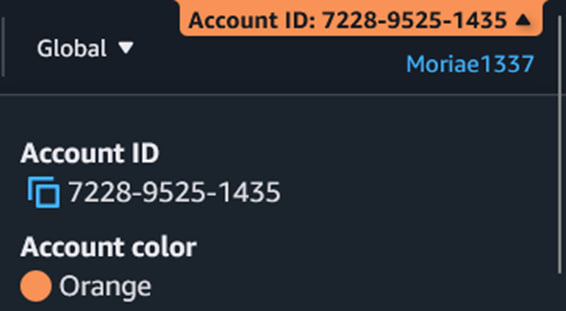

# Lab 1 — Infrastructure Setup

## Overview

This lab focuses on setting up the base cloud infrastructure for future projects.  
The goal is to configure user access, roles, and networking components in a selected cloud provider (AWS, GCP, or similar).  
All resources can be deployed manually or using Infrastructure as Code (IaC) tools such as Terraform, CloudFormation, or OpenTofu.

## 1. Cloud Account Setup

Created a root account in the chosen cloud provider.  
Then configured an IAM user with **FullAdmin** privileges for all further interactions with the system.

**Screenshot:**  

---

## 2. (Optional) Organization Creation

Created an **Organization** to group and manage multiple accounts under a single administrative structure.  
All following labs will be performed within this organization.

**Screenshot:**  

---

## 3. IAM Read-Only User

Created a new IAM user and a policy that grants **view-only permissions** (no write access).  
This user can monitor resources but cannot modify them.

**Screenshot:**  

---

## 4. IAM Role for Read-Only User

Created an IAM **Role** linked to the view-only policy.  
Configured it to be assumable by the user from step 3.

**Screenshot:**  

---

## 5. (Optional) IaC for Policy and Role

Prepared a **CloudFormation** or **Terraform** template that defines the IAM policy and role created in the previous steps.  
This allows for automated deployment and version control.

File: [task5.yaml](./resources/task5.yaml)

**Screenshot:**  

---

## 6. Network Configuration (VPC)

Configured a **Virtual Private Cloud (VPC)** with both **public and private subnets**:

- Public subnet connected to an **Internet Gateway (IGW)**
- Private subnets used for internal communication only

**Screenshot:**  

---

## 7. (Optional) IaC Stack for Networking

Created an **IaC stack** describing the VPC, subnets, IGW, and routing configuration.  
This ensures the network setup is easily reproducible.

File: [task7.yaml](./resources/task7.yaml)

**Screenshot:**  

---

## 8. Monthly Budget Estimation for Lab 2 (Two Shards)

Estimated the monthly cost of running the infrastructure for **Lab 2**, assuming **two shards** are used.

| Resource              | Quantity | Unit Price   | Monthly Cost (USD) |
| --------------------- | -------- | ------------ | ------------------ |
| EC2 t3.micro          | 2        | $0.0104/hour | $14.98             |
| NAT Gateway           | 1        | $0.045/hour  | $33.30             |
| EBS Storage (10 GB)   | 2        | $0.10/GB     | $2.00              |
| Elastic IP            | 1        | $0.005/hour  | $3.60              |
| Data Transfer (10 GB) | -        | $0.09/GB     | $0.90              |
| **Total**             | -        | -            | **$54.78**         |

---

## Conclusions

During this lab, the core cloud infrastructure was configured.  
IAM users, roles, and policies were created to ensure secure access control.  
A VPC with public and private subnets was established, providing the foundation for future distributed services.  
Additionally, an estimated monthly budget for the next lab’s setup (with two shards) was calculated to evaluate expected operational costs.
